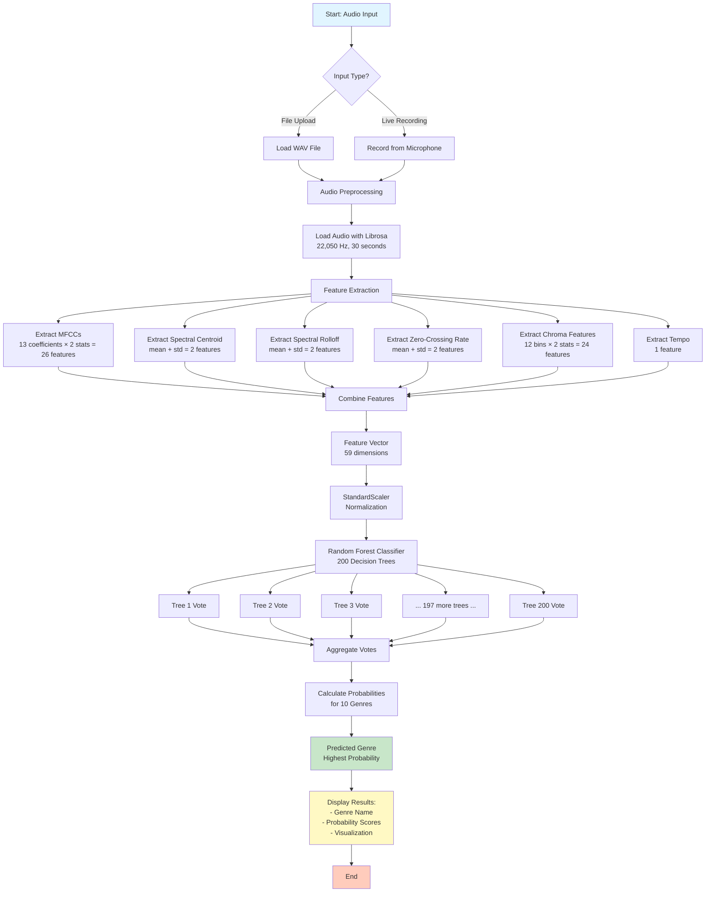
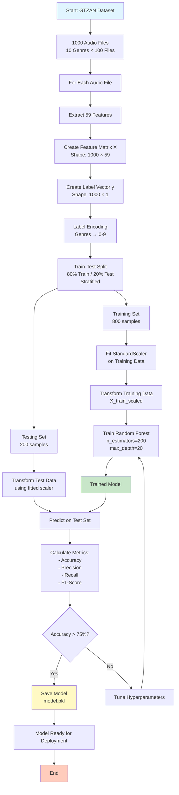
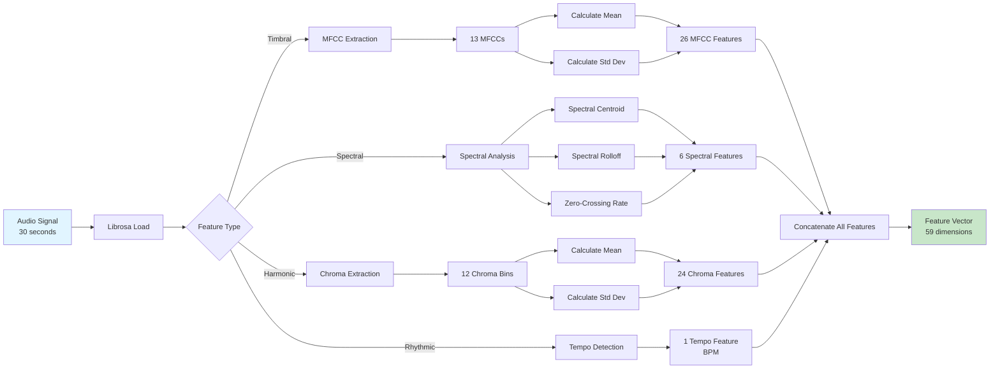
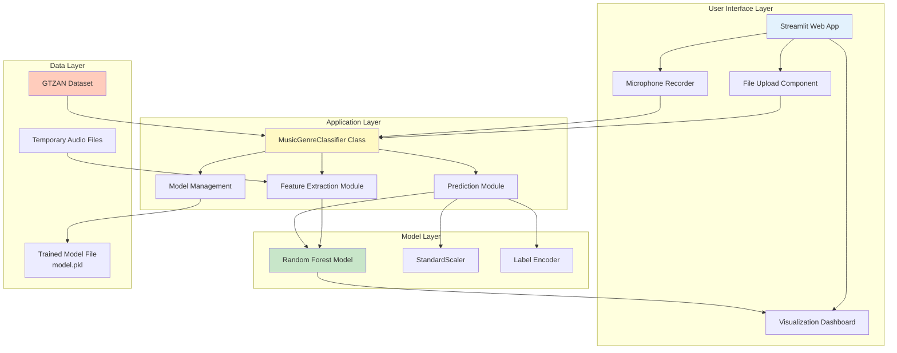
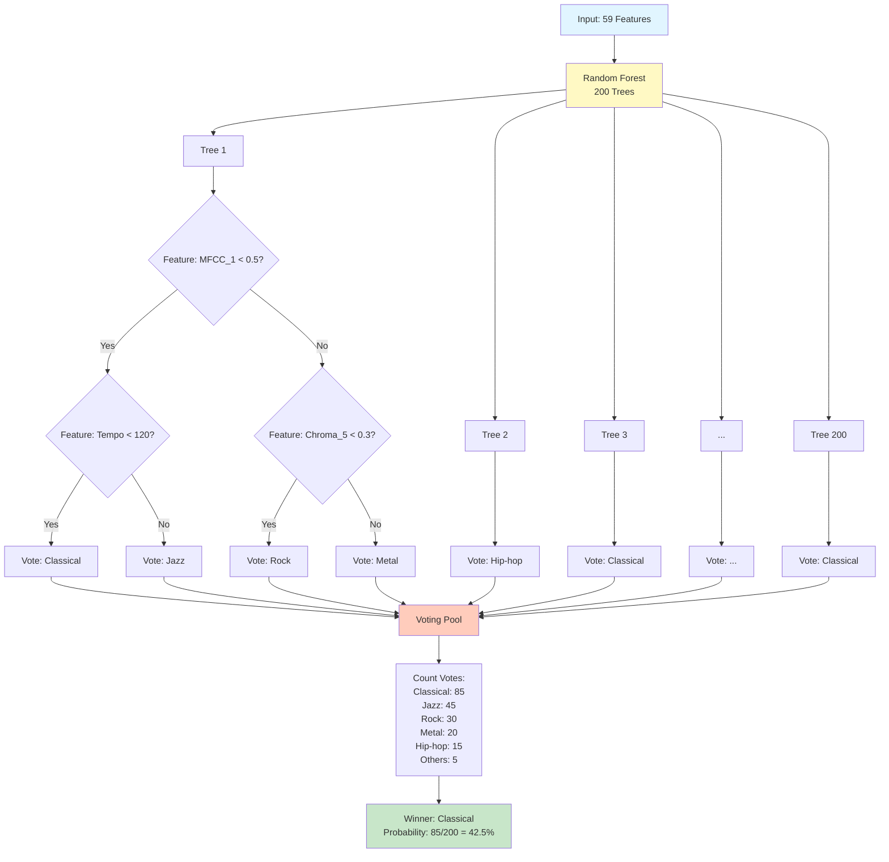
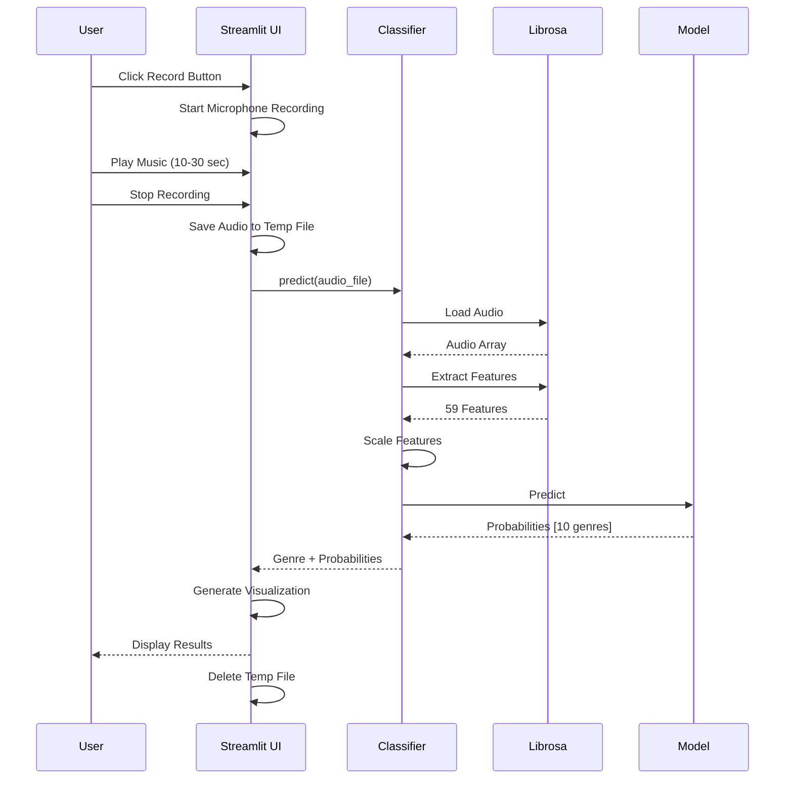
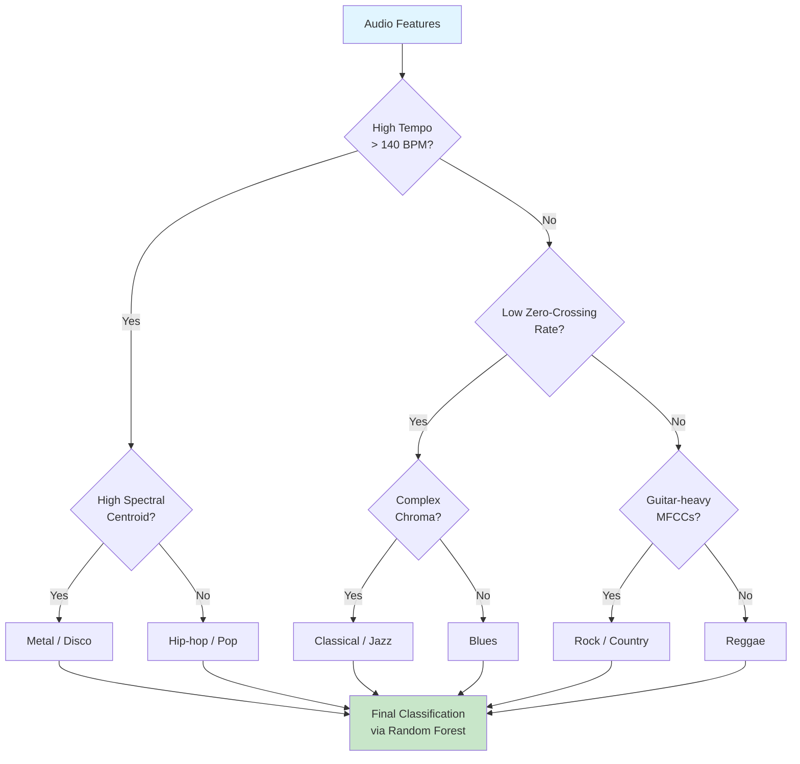

# Music Genre Classifier - Flowcharts and Diagrams

This file contains Mermaid diagram code that can be rendered in GitHub, GitLab, or using Mermaid Live Editor (https://mermaid.live/)

---

## 1. Main Workflow Diagram - Prediction Process

---

## 2. Training Workflow Diagram

---

## 3. Feature Extraction Pipeline

---

## 4. System Architecture Diagram

---

## 5. Decision Tree Ensemble Visualization

---

## 6. Real-time Prediction Flow

---

## 7. Genre Classification Decision Boundaries

---

## How to Use These Diagrams

### Option 1: Mermaid Live Editor (Recommended)
1. Go to https://mermaid.live/
2. Copy any diagram code from above
3. Paste into the editor
4. Export as PNG, SVG, or PDF

### Option 2: GitHub/GitLab
- These diagrams render automatically in GitHub and GitLab markdown files

### Option 3: VS Code
- Install "Markdown Preview Mermaid Support" extension
- View this file in preview mode

### Option 4: Draw.io / Lucidchart
- Use the text descriptions to manually create diagrams
- Import Mermaid diagrams (some tools support this)

### Option 5: Miro Board
To create in Miro:
1. Create shapes for each box
2. Connect with arrows
3. Use colors from the style definitions:
   - #e1f5ff (light blue) - Input/Start
   - #c8e6c9 (light green) - Output/Success
   - #fff9c4 (light yellow) - Processing
   - #ffccbc (light orange) - End/Decision

---

## Diagram Descriptions for Manual Creation

If you prefer to create diagrams manually in Miro or other tools, here are the key components:

### Main Workflow (Top to Bottom):
1. **Input Layer**: Audio File Upload OR Microphone Recording
2. **Preprocessing**: Load audio, normalize
3. **Feature Extraction**: 5 parallel branches (MFCCs, Spectral, Chroma, ZCR, Tempo)
4. **Feature Combination**: Merge into 59-dimensional vector
5. **Normalization**: StandardScaler
6. **Classification**: Random Forest (200 trees)
7. **Output**: Genre prediction + probabilities

### Training Workflow (Top to Bottom):
1. **Data Loading**: GTZAN Dataset (1000 files)
2. **Feature Extraction**: Process all files
3. **Data Splitting**: 80/20 train/test
4. **Scaling**: Fit scaler on training data
5. **Training**: Random Forest training
6. **Evaluation**: Calculate metrics
7. **Model Saving**: Save to pickle file

Use rectangles for processes, diamonds for decisions, and arrows for flow direction.
